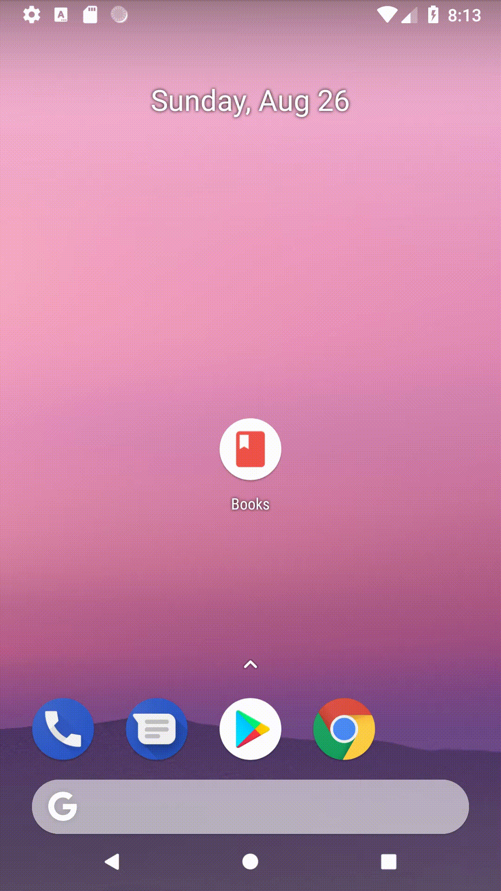

# Project 8: Books Catalog App
This is the eight project deliverable for the Android Basic Nanodegree course at Udacity as part of the Grow with Google Scholarship. The goal of this project is to demonstrate and practice the Android data and file storage procedures. For this project, a book catalog will be built using available database manipulation helpers: SQLiteDatabase, Cursors, etc. Also, UI elements such as Spinners, FloatingActionButtons and menus are explored.

### Prerequisites

1. I had been following the lectures to make an interactive android app as part of Udacity's Grow With Google Anroid Basics Nanodegree [Udacity](https://www.udacity.com/course/android-basics-nanodegree-by-google--nd803)
2. Download this repository and use Android Studio IDE to run the project locally via USB connected Android phone or Android Studio's AVD Manager.

### Learning Milestones

## Inventory App, Stage 1 (Project 8):

#### At this point, the app demonstrates the learners ability to 
1. Design and Create a database schema
2. Install SQLite on own computer to practice SQL query statements
3. Use Android Profiler or the deprecated Android Profiler from the GUI and the command line to export the actual database file created in the emulator
4. Connect to the database, populate the database, and query via various Android UI
5. Understand SQL Injection Risks and best mitigation practices

### Screenshot Recording

Below is a screen recording of the Book Catalog App. Note: User Interface improvement and more advanced concepts will be incorporated on Project 9:

### App File Structure 

![screenshot of the files involved in creating the app with the help of Gradle and the Android Studio IDE][filestruct]

## Inventory App, Stage 2 (Project 9):

#### At this point, the app demonstrates the learners ability to 
6. Understand the importance of using ContentProviders and re refactor the code to replace any methods that directly access the database with the more robust ContentProviders
7. Understand how to use URIs along with ContentResolvers, which acts like a router between the UI Activities database calls and the ContentProvider
8. Integrate the Cursor, CursorLoaders, and LoaderManagers to provide a more robust thread managment and app life-cycle database interactions via ContentProviders 
9. Provide Sanity Checks or Data Validation to minimize errors during user inputs
10. Load data from the database into UI input forms for Updates
11. Applying good practice to improve the CRUD (Create, Read, Update, Delete) functionality of the Book Catalog App

### Screenshot Recording

Below is a screen recording of the Book Catalog App after applying the concepts discussed in the Udacity video lessons. Note: More tweaking will be needed to satisfy the Project 9 rubics requirements:

### Screenshot of the CursorLoader Diagram from Udacity Youtube: https://www.youtube.com/watch?time_continue=1&v=eXCGoId2eoE 

![screenshot of the CursorLoader Diagram from Udacity Youtube video ][cursorloader]

[cursorloader]: https://github.com/roylouislgarcia/BookCatalog/blob/master/cursorloader.png
[filestruct]: https://github.com/roylouislgarcia/BookCatalog/blob/master/filestructure.JPG
